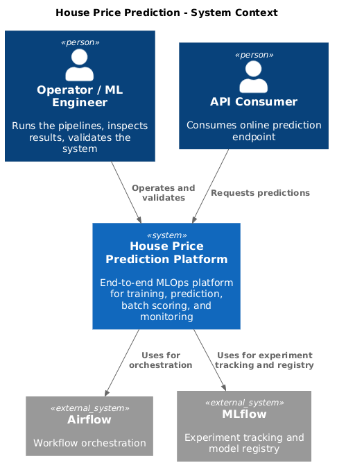
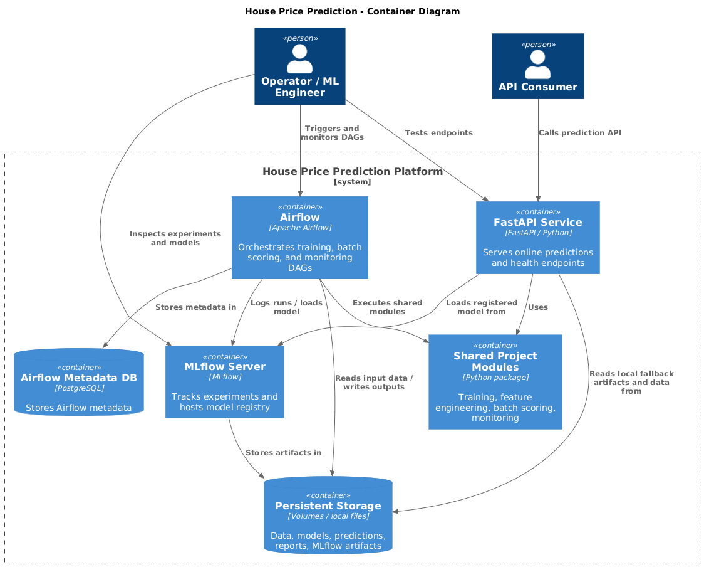
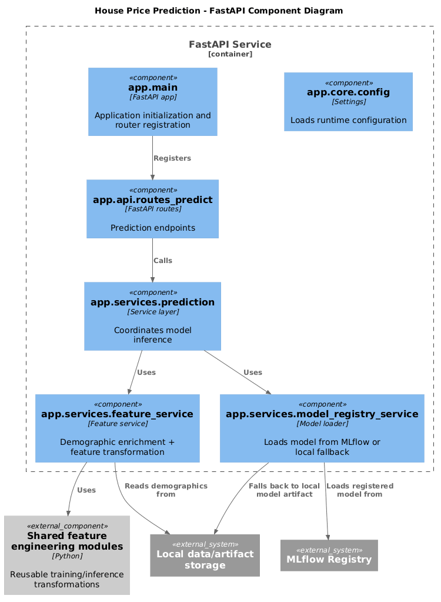
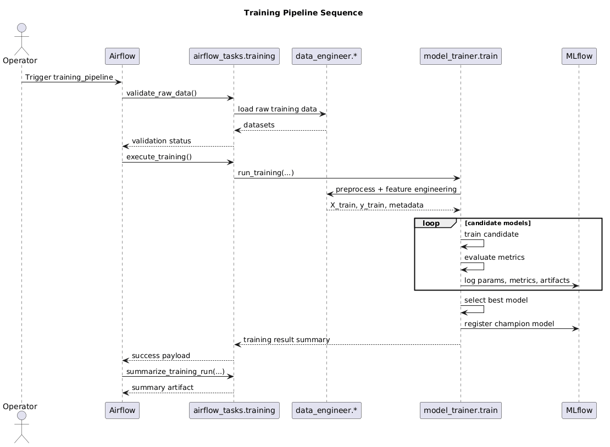
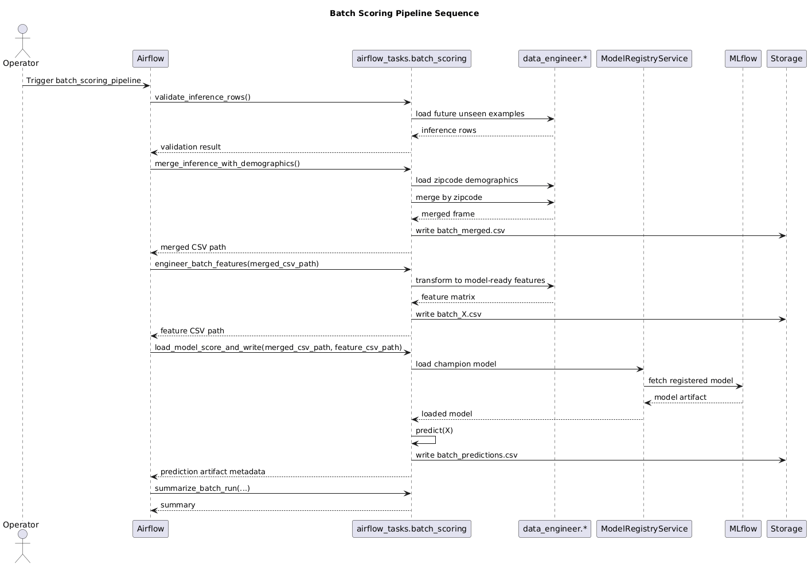
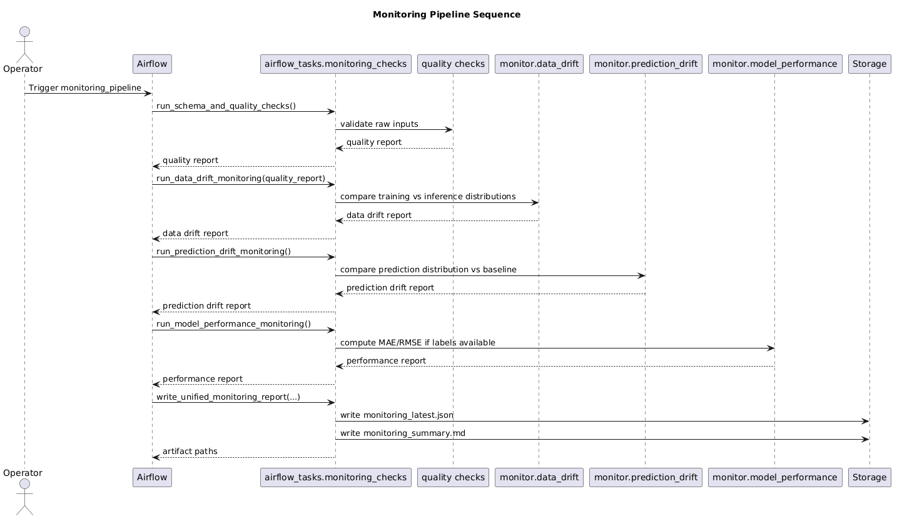

---

# Architecture Document — House Price Prediction MLOps Platform

## 1. Purpose

This document describes the system architecture for the House Price Prediction MLOps project.

The platform was designed to demonstrate a production-style ML lifecycle covering:

- model training
- experiment tracking
- model selection and registration
- online inference
- batch scoring
- monitoring

The architecture prioritizes:
- reproducibility
- service separation
- shared feature logic
- observability
- local operability with Docker Compose

---

## 2. Scope

This document covers:

- C4 Context view
- C4 Container view
- C4 Component view
- sequence diagrams for:
  - training pipeline
  - batch scoring pipeline
  - monitoring pipeline

---

## 3. Architectural Principles

### 3.1 Separation of concerns
The system separates:
- serving
- orchestration
- experiment tracking
- monitoring

### 3.2 Shared feature contract
Training, API serving, and batch scoring reuse the same feature preparation logic to reduce training-serving skew.

### 3.3 Registry-driven deployment
The best model is promoted into MLflow Model Registry and later consumed by batch scoring and FastAPI serving.

### 3.4 Pipeline-first operations
Training, batch scoring, and monitoring are treated as orchestrated pipelines, not ad hoc scripts.

### 3.5 Local reproducibility
All major services run locally through Docker Compose to support development, debugging, demos, and take-home evaluation scenarios.

---

## 4. System Context (C4 Level 1)

### Actors
- **Operator / ML Engineer**  
  Runs the platform, triggers DAGs, inspects metrics, validates outputs.

- **API Consumer**  
  Calls the prediction API to obtain house price estimates.

### External/Platform systems
- **Airflow**
  Orchestrates DAGs.

- **MLflow**
  Tracks experiments and stores the registered champion model.

### System
- **House Price Prediction Platform**
  End-to-end ML application for price prediction, model tracking, scoring, and monitoring.

---

## 5. Container View (C4 Level 2)

### 5.1 FastAPI Service
Responsibilities:
- expose health endpoint
- expose prediction endpoints
- load champion model from MLflow registry or local fallback
- prepare inference features
- return prediction responses

Technology:
- FastAPI
- Python
- scikit-learn inference pipeline

### 5.2 Airflow Webserver / Scheduler
Responsibilities:
- orchestrate training, batch scoring, and monitoring workflows
- manage retries, logs, execution history
- coordinate pipeline execution

Technology:
- Apache Airflow

### 5.3 MLflow Server
Responsibilities:
- store experiment runs
- log metrics, params, and artifacts
- host model registry
- persist champion model versions

Technology:
- MLflow server
- local SQLite backend
- artifact store directory

### 5.4 Postgres
Responsibilities:
- Airflow metadata database

Technology:
- PostgreSQL

### 5.5 Shared Project Code
Responsibilities:
- data loading
- preprocessing
- feature engineering
- model training
- monitoring logic
- batch scoring logic

Technology:
- Python modules reused by Airflow and FastAPI

### 5.6 Persistent Storage
Responsibilities:
- raw data
- processed data
- MLflow artifacts
- local fallback model artifacts
- monitoring reports

---

## 6. Component View (C4 Level 3)

## 6.1 FastAPI Service Components

### `app.main`
- creates the FastAPI application
- registers routers
- initializes startup configuration

### `app.api.routes_predict`
- defines prediction endpoints
- validates request payloads
- delegates business logic to services

### `app.services.prediction`
- orchestrates prediction workflow
- calls feature service
- calls model registry / model loader
- returns inference results

### `app.services.feature_service`
- enriches requests with zipcode demographics
- applies shared feature transformation logic
- ensures serving features match training contract

### `app.services.model_registry_service`
- loads the registered model from MLflow
- falls back to local joblib artifact if necessary

### `app.core.config`
- centralizes runtime configuration
- loads environment variables and defaults

---

## 6.2 Training Components

### `model_trainer.train`
- main training entrypoint
- compares multiple candidate models
- logs runs to MLflow
- selects champion model

### `model_trainer.evaluate`
- computes metrics such as MAE, RMSE, and R²

### `model_trainer.register`
- handles model registration into MLflow

### `data_engineer.preprocessing`
- loads and normalizes raw data
- handles demographic merge

### `data_engineer.feature_engineering`
- creates engineered columns
- builds model-ready feature sets
- defines shared feature metadata

---

## 6.3 Batch Scoring Components

### `airflow_tasks.batch_scoring`
Responsibilities:
- validate unseen examples
- merge demographics
- engineer features
- load champion model
- score batch predictions
- write predictions file

---

## 6.4 Monitoring Components

### `airflow_tasks.monitoring_checks`
Orchestrates monitoring execution.

### `monitor.data_drift`
- compares training vs inference features
- calculates statistical drift indicators

### `monitor.prediction_drift`
- compares prediction distribution against baseline

### `monitor.model_performance`
- computes performance metrics when labels are available

---

## 7. Data Flow Overview

### Training flow
raw training data → preprocessing → feature engineering → candidate model training → evaluation → MLflow logging → best model registration

### Batch scoring flow
future unseen data → demographic enrichment → feature engineering → model load → prediction generation → batch predictions artifact

### Monitoring flow
raw/batch outputs → quality checks → drift checks → optional performance evaluation → monitoring report

---

## 8. C4 PlantUML — System Context

## 9. C4 PlantUML — Conteiner View

## 10. C4 PlantUML — Component View (FastAPI)

## 11 Sequence Diagram — Training Pipeline

## 12 Sequence Diagram — Batch Scoring Pipeline

## 13 Sequence Diagram — Monitoring Pipeline

## 14. Operational Expectations

### Training Pipeline

Expected outcome:

 - all training tasks succeed
 - candidate models appear - in MLflow best model is registered

### Batch Scoring Pipeline

Expected outcome:

 - batch predictions are written successfully
 - predicted_price is produced for each row

### Monitoring Pipeline

Expected outcome:

 - quality passes
 - drift is evaluated
 - prediction drift is computed from batch scoring artifact
 - performance is skipped unless labels are provided